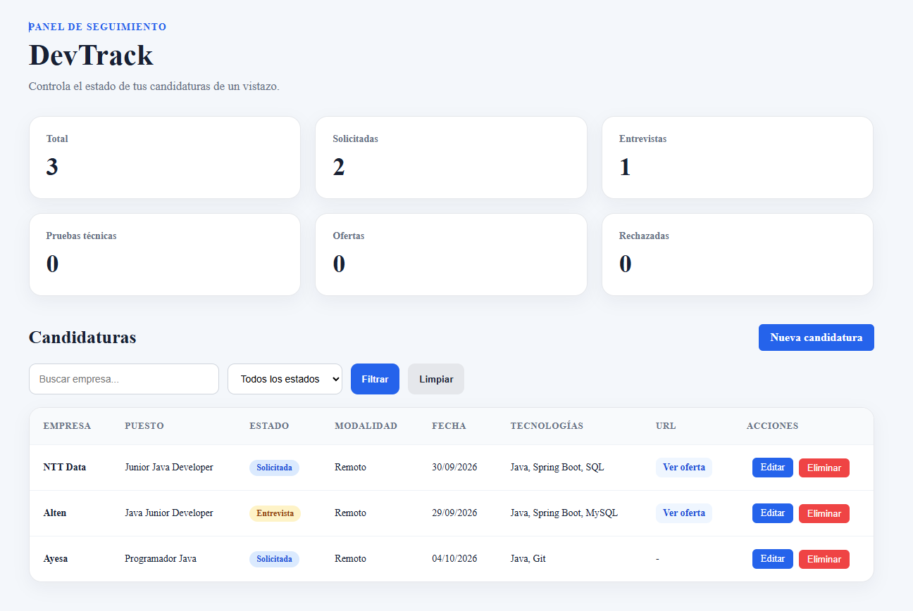
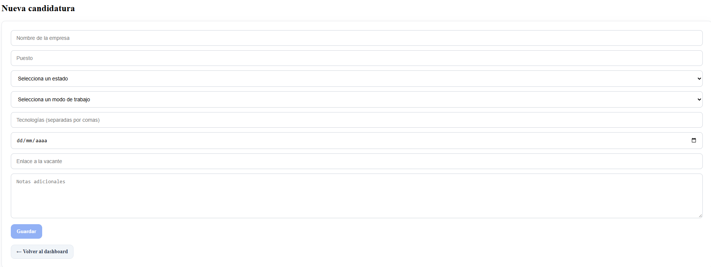
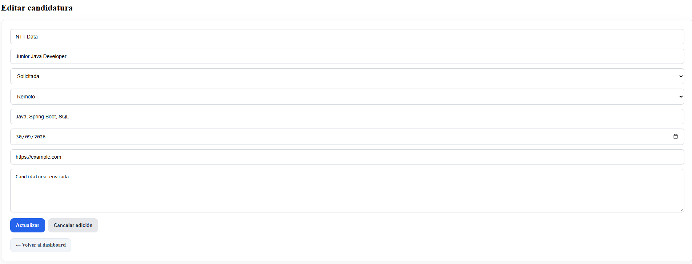

# DevTrack

Aplicación Full Stack para gestionar y realizar el seguimiento de candidaturas de empleo.

DevTrack permite registrar ofertas de trabajo, consultar su estado, editar candidaturas, aplicar filtros y visualizar estadísticas desde un dashboard.

## 🛠 Tecnologías

### Backend
- Java 21
- Spring Boot
- Spring Data JPA
- Hibernate
- MySQL
- Maven
- Bean Validation

### Frontend
- Angular 22
- TypeScript
- Angular Signals
- Angular Router
- HttpClient
- HTML5
- CSS3

## ✨ Funcionalidades

- Crear candidaturas
- Editar candidaturas
- Eliminar candidaturas
- Consultar todas las candidaturas
- Buscar por empresa
- Filtrar por estado
- Dashboard con estadísticas
- Estados visuales mediante badges
- Acceso directo a la oferta original
- Gestión de errores de conexión
- Diseño responsive
- Navegación mediante Angular Router

## 📊 Estados de una candidatura

- Pendiente
- Solicitada
- Entrevista
- Prueba técnica
- Oferta
- Rechazada

## 📸 Capturas

### Dashboard

### Nueva candidatura

### Editar candidatura

